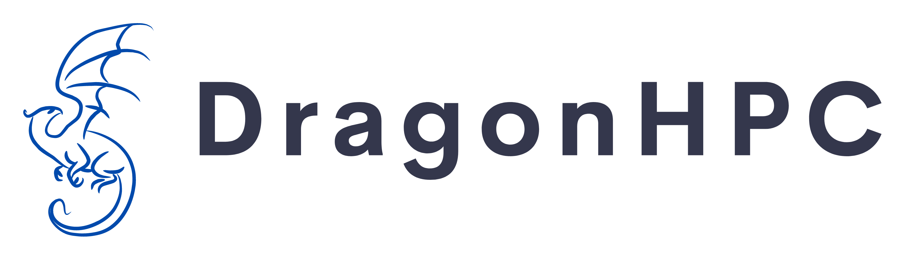
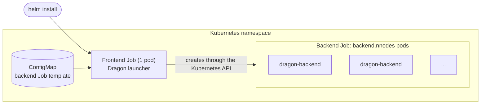

# Dragon Cloud

This repository has example [Helm](https://helm.sh) charts for running [Dragon](https://dragonhpc.org) on Kubernetes.

Dragon is a distributed runtime that scales standard Python code, such as `multiprocessing`, and Dragon's own APIs,
such as the Distributed Dictionary, from a laptop to many nodes. The charts here start a Dragon runtime that spans
several Kubernetes pods. Your code then runs across all of them.

> [!IMPORTANT]
> These charts are **examples**, not turnkey products. You need to supply your own container image and shared storage,
> and you'll probably need to adjust resources and scheduling settings in `values.yaml` for your cluster. Each chart's
> README lists the values to check.

## Charts

| Chart | What it runs | When to use it |
|---|---|---|
| [dragonhpc](charts/dragonhpc) | One Python program under `dragon`. The Jobs complete when the program exits. | Batch-style runs, such as benchmarks, simulations, and data pipelines. |
| [dragonhpc-jupyter](charts/dragonhpc-jupyter) | A Jupyter server inside a Dragon runtime. The runtime keeps running until you uninstall. | Interactive development and exploration in notebooks. |

## How the charts work

Both charts use the same frontend/backend layout:



1. Helm creates a **frontend Job** with one pod, plus a ConfigMap that holds a template for the **backend Job**.
2. The frontend pod starts the Dragon launcher: `dragon` for the dragonhpc chart, `dragon-jupyter` for the
   dragonhpc-jupyter chart. The launcher detects that it's running on Kubernetes, fills in the backend template, and
   creates the backend Job with `backend.nnodes` pods. Because of this step, the frontend's ServiceAccount needs
   permission to create Jobs.
3. Each backend pod runs `dragon-backend` and joins the runtime. The backend pods together act as the Dragon "nodes"
   that run your code.
4. The frontend Job owns the backend Job. Deleting the release or the frontend Job also removes the backend pods.

## Prerequisites

- A Kubernetes cluster, plus [Helm 3](https://helm.sh/docs/intro/install/) and `kubectl` configured for it.
- Permission to run privileged pods in the target namespace. Dragon needs this for shared memory and RDMA.
- A container image with Python, the `dragonhpc` package, and the `kubernetes` Python package. The Jupyter chart also
  needs `jupyter`. To get started, see
  [deploy/kubernetes/Dockerfile](https://github.com/DragonHPC/dragon/blob/main/deploy/kubernetes/Dockerfile) in the
  Dragon repository.
- A `ReadWriteMany` PersistentVolumeClaim that all pods share, for code, data, and logs.

Each chart's README has the full list.

## Quick start

```bash
git clone https://github.com/DragonHPC/dragon-cloud.git
cd dragon-cloud

# 1. Write my-values.yaml for your cluster. Each chart's README has an example.
# 2. Install one of the charts:
helm install hello ./charts/dragonhpc -n <namespace> -f my-values.yaml

# 3. Follow the output:
kubectl logs -n <namespace> -f --tail=-1 -c frontend \
  -l app.kubernetes.io/instance=hello,app.kubernetes.io/component=dragon-frontend

# 4. Clean up:
helm uninstall hello -n <namespace>
```

For the Jupyter chart, you need to create a token Secret before you install. See the
[dragonhpc-jupyter README](charts/dragonhpc-jupyter/README.md).

## Rancher

Both charts include `questions.yml` and `catalog.cattle.io` annotations, so you can add this repository to Rancher as
an app catalog. Rancher then prompts for the most common values when you install.

## Getting help

- [Dragon documentation](https://dragonhpc.github.io/dragon/doc/_build/html/index.html)
- [Dragon source code](https://github.com/DragonHPC/dragon)
- To report a problem with these charts, open an issue in this repository.
- To join the [DragonHPC Slack](https://dragonhpc.slack.com/), email [dragonhpc@hpe.com](mailto:dragonhpc@hpe.com).

## License

[MIT](LICENSE)
