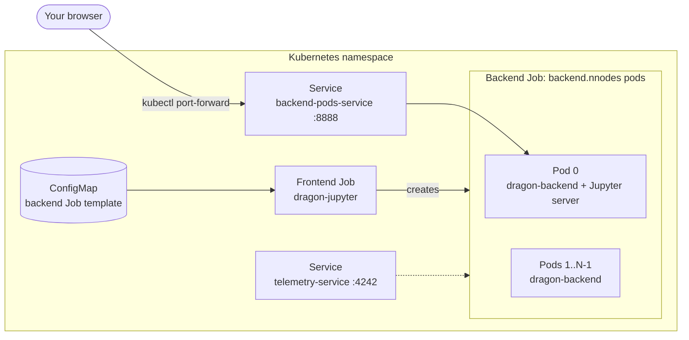

# DragonHPC Jupyter chart

> [!IMPORTANT]
> This is an **example** chart. It shows one way to use [Dragon](https://dragonhpc.org) interactively on
> Kubernetes. You need to supply your own container image with Dragon and Jupyter installed
> (`pip install dragonhpc jupyter`) and shared storage, and you'll probably need to adjust the resources and
> scheduling settings in `values.yaml` for your cluster. Treat the chart as a starting point, not as a supported
> product.

This chart starts a Dragon runtime that spans `backend.nnodes` pods and runs a Jupyter server inside that runtime.
Notebook code can use Dragon's distributed `multiprocessing`, the Distributed Dictionary (`DDict`), and the rest of
the Dragon API, and that work runs on all backend pods.

To run a Python script to completion instead of working interactively, use the [dragonhpc](../dragonhpc) chart.

## How it works



1. `helm install` creates a frontend Job, a ConfigMap that holds a template for the backend Job, two Services, and a
   ServiceAccount with RBAC rules for each tier.
2. The frontend pod runs `dragon-jupyter`. The Dragon launcher detects Kubernetes, reads the backend template from the
   ConfigMap, and creates the backend Job with `backend.nnodes` pods through the Kubernetes API. The frontend Job owns
   the backend Job, so deleting the frontend Job also deletes the backend pods.
3. Each backend pod runs `dragon-backend` and joins the runtime. The primary backend pod (pod 0) labels itself so
   that `backend-pods-service` routes to it, and it runs the Jupyter server on port 8888. The server reads its login
   token from a Secret that you create.
4. You port-forward the Service and open Jupyter in your browser.

## Prerequisites

- A Kubernetes cluster where you can create Jobs, Services, ConfigMaps, ServiceAccounts, Roles, and RoleBindings in
  the target namespace.
- [Helm 3](https://helm.sh/docs/intro/install/) and `kubectl`.
- One schedulable node per backend pod. The chart prefers to put backend pods on separate nodes and away from the
  frontend pod, but doesn't require it.
- The frontend pod doesn't need a compute node. It only runs the Dragon launcher, and Jupyter runs on a backend pod, so
  the frontend can run on any node, such as a service node without GPUs. To choose its node, set
  `frontend.nodeSelector`.
- Permission to run **privileged** pods. Backend pods run privileged with the `IPC_LOCK`, `IPC_OWNER`, and
  `SYS_RESOURCE` capabilities, which Dragon needs for shared memory and RDMA. Namespaces that enforce the `baseline` or
  `restricted` [Pod Security Standard](https://kubernetes.io/docs/concepts/security/pod-security-standards/) reject
  these pods.
- A container image for both frontend and backend pods. The image needs:
  - Python with the `dragonhpc` package (`pip install dragonhpc`), ideally at the chart's `appVersion` (`0.12.0`)
  - `jupyter`
  - the `kubernetes` Python package, which Dragon uses to talk to the Kubernetes API
  - UCX libraries in `/usr/lib/x86_64-linux-gnu/`, if you keep the default high-speed transport setup in
    `frontend.args` and `backend.args`

  [deploy/kubernetes/Dockerfile](https://github.com/DragonHPC/dragon/blob/main/deploy/kubernetes/Dockerfile) in the
  Dragon repository is a good place to start.
- A `ReadWriteMany` PersistentVolumeClaim that all pods can mount, for notebooks and data. The defaults expect a claim
  named `dragon-shared`, mounted at `/shared`.
- Access to the `busybox` image, which the uninstall hook uses.

## Configure

Create a values file for your cluster. Check these values first:

| Value | Default | What to change |
|---|---|---|
| `frontend.image`, `backend.image` | `<your-repository-here>:<your-tag-here>` | Point both at your Dragon + Jupyter image. |
| `frontend.volumes`, `frontend.volumeMounts`, `backend.volumes`, `backend.volumeMounts` | PVC `dragon-shared` mounted at `/shared` | Create a PVC named `dragon-shared`, or replace `volumes` under both `frontend` and `backend` with your own claim. |
| `backend.resources` | 4 `nvidia.com/gpu` (request and limit) | Set the GPU, CPU, and memory for each backend pod. On CPU-only clusters, set to `null`. |
| `backend.tolerations` | Tolerate `node-role.kubernetes.io/compute` and `nvidia.com/gpu.present` taints | Add tolerations for any taints on the nodes you want to use. |
| `sharedMemoryVolume.sizeLimit` | `64Gi` | Dragon allocates its memory pools in `/dev/shm`, which is memory-backed. Keep this within the memory of a node. |
| `backend.nnodes` | `2` | Set the number of backend pods. |

> [!NOTE]
> Helm merges maps from your values file into the chart defaults, but it replaces lists. To remove a default map entry,
> such as the GPU request in `backend.resources`, set it to `null`. Lists such as `volumes` and `tolerations` are
> replaced completely by whatever you provide.

Example `my-values.yaml`:

```yaml
frontend:
  image:
    repository: registry.example.com/dragon-jupyter
    tag: "0.12.0"

backend:
  nnodes: 2
  image:
    repository: registry.example.com/dragon-jupyter
    tag: "0.12.0"
  resources:
    limits:
      nvidia.com/gpu: 1
    requests:
      nvidia.com/gpu: 1
```

### Where notebooks are stored

Unless it's configured otherwise, Jupyter keeps notebooks in the working directory of backend pod 0. With the default
values, that's the image's default working directory inside the container, so your notebooks are deleted with the pod.
To keep them, put the working directory on the shared volume. If `frontend.workingDir` is empty and
`frontend.volumeMounts` has a second entry, the chart uses that entry's `mountPath` as the working directory for every
pod. Add the same mount to `backend.volumeMounts`, too:

```yaml
frontend:
  volumeMounts:
    - name: shared
      mountPath: /shared
    - name: shared
      mountPath: /notebooks
      subPath: notebooks
backend:
  volumeMounts:
    - name: shared
      mountPath: /shared
    - name: shared
      mountPath: /notebooks
      subPath: notebooks
```

## Install

1. Choose a release name of **11 characters or fewer** (see [Known limitations](#known-limitations)) and a namespace:

   ```bash
   export RELEASE=nb
   export NAMESPACE=dragon
   ```

2. Create the Secret that holds the Jupyter token. The name must be `dragonhpc-jupyter-<release>-jupyter-token`:

   ```bash
   python3 -c "import secrets; print(secrets.token_hex(16))" | \
     kubectl create secret generic dragonhpc-jupyter-${RELEASE}-jupyter-token \
       -n ${NAMESPACE} --from-file=jupyter_token=/dev/stdin
   ```

   Backend pods read the token from this Secret. If it's missing, they stay in `CreateContainerConfigError` until you
   create it. If the Secret doesn't exist when you install, the notes that `helm install` prints include this command.

3. Install the chart. Run this from the repository root:

   ```bash
   helm install ${RELEASE} ./charts/dragonhpc-jupyter -n ${NAMESPACE} -f my-values.yaml
   ```

4. Watch the pods start. The frontend pod comes up first, and the backend pods appear after Dragon creates the backend
   Job:

   ```bash
   kubectl get pods -n ${NAMESPACE} -l app.kubernetes.io/instance=${RELEASE} -w
   ```

## Use Jupyter

1. Forward the Jupyter Service to your machine:

   ```bash
   kubectl port-forward -n ${NAMESPACE} svc/backend-pods-service 8888:8888
   ```

2. Open <http://localhost:8888> and log in with the token:

   ```bash
   kubectl get secret dragonhpc-jupyter-${RELEASE}-jupyter-token -n ${NAMESPACE} \
     -o jsonpath='{.data.jupyter_token}' | base64 -d
   ```

3. To check that the notebook is connected to the Dragon runtime, run this in a cell:

   ```python
   from dragon.native.machine import System, Node

   system = System()
   print(f"Dragon runtime spans {system.nnodes} nodes")
   for h_uid in system.nodes:
       node = Node(h_uid)
       print(f"{node.hostname}: {node.num_cpus} CPUs, {node.num_gpus} GPUs")
   ```

   The output should list one line for each backend pod. From here, you use Dragon the same way you would outside
   Kubernetes. To learn more, see [Introduction to Dragon](https://dragonhpc.github.io/dragon/doc/_build/html/start.html).

## Telemetry

The chart also creates `telemetry-service` on port 4242. It routes to the backend pod that runs Dragon's telemetry
aggregator, which serves an OpenTSDB-compatible API. To view the metrics, add the Service to Grafana as an OpenTSDB data
source. A Grafana instance in the same cluster can use
`http://telemetry-service.<namespace>.svc.cluster.local:4242`. You can also forward the port to your machine:

```bash
kubectl port-forward -n ${NAMESPACE} svc/telemetry-service 4242:4242
```

The Service only has an endpoint while Dragon telemetry is enabled. Telemetry also requires the `dragonhpc[telemetry]`
extras in the image.

## Uninstall

```bash
helm uninstall ${RELEASE} -n ${NAMESPACE}
```

Uninstalling deletes the frontend and backend Jobs and their pods, plus the ConfigMap, Services, and RBAC objects.
Before Helm deletes anything, a pre-delete hook runs a `busybox` Job that removes this release's Dragon log files from
the working directory, if the working directory is on the shared volume.

Helm doesn't manage the token Secret. If you keep it, the chart reuses the same token the next time you install with
the same release name. To delete it:

```bash
kubectl delete secret dragonhpc-jupyter-${RELEASE}-jupyter-token -n ${NAMESPACE}
```

## Values reference

| Key | Default | Description |
|---|---|---|
| `backend.nnodes` | `2` | Number of backend pods, which is the number of Dragon nodes. |
| `frontend.image`, `backend.image` | placeholders | Container image `repository`, `tag`, and `pullPolicy`. If `tag` is empty, the chart's `appVersion` is used. |
| `frontend.imagePullSecrets`, `backend.imagePullSecrets` | `[]` | Secrets for pulling from a private registry. |
| `frontend.command`, `frontend.args` | Configure the UCX transport, then run `dragon-jupyter` | Frontend entry point. |
| `backend.command`, `backend.args` | Configure the UCX transport, then run `dragon-backend` | Backend entry point. The last command must be `dragon-backend`. |
| `frontend.env`, `backend.env` | none | Extra environment variables, given as a list of `name`/`value` entries. |
| `frontend.workingDir`, `frontend.batchName` | empty | If `workingDir` is set, pods start in `<first frontend mountPath>/<workingDir>/<batchName>`. |
| `frontend.volumes`, `backend.volumes`, `frontend.volumeMounts`, `backend.volumeMounts` | PVC `dragon-shared` at `/shared` | Volumes for notebooks and data. See [Where notebooks are stored](#where-notebooks-are-stored). |
| `sharedMemoryVolume.name`, `sharedMemoryVolume.sizeLimit`, `sharedMemoryVolume.mountPath` | `dragonshm`, `64Gi`, `/dev/shm` | Memory-backed `emptyDir` that's mounted in every pod for Dragon's shared memory. |
| `frontend.resources`, `backend.resources` | none, 4 GPUs | Container resource requests and limits. |
| `frontend.nodeSelector`, `backend.nodeSelector`, `frontend.affinity`, `backend.affinity`, `frontend.tolerations`, `backend.tolerations` | No node selectors. The backend tolerates two taints. | Pod scheduling. If `backend.affinity` is empty, backend pods avoid the frontend's node. |
| `backend.topologySpreadConstraints` | Spread across nodes | If empty, the chart spreads backend pods across nodes on a best-effort basis. |
| `frontend.securityContext`, `backend.securityContext`, `frontend.podSecurityContext`, `backend.podSecurityContext` | Backend is privileged | Pod and container security settings. |
| `frontend.serviceAccount.*`, `backend.serviceAccount.*`, `frontend.rbac.create`, `backend.rbac.create` | Create all | ServiceAccounts and Roles. The frontend needs to create Jobs and read pods. The backend needs to read and patch pods. |
| `frontend.ttlSecondsAfterFinished`, `backend.ttlSecondsAfterFinished` | `300` | How long, in seconds, Kubernetes keeps a finished Job before deleting it. |
| `jupyterService.name`, `jupyterService.type`, `jupyterService.port`, `jupyterService.targetPort`, `jupyterService.protocol` | `backend-pods-service`, `ClusterIP`, `8888`, `8888`, `TCP` | Service in front of the Jupyter server. |
| `telemetryService.name`, `telemetryService.type`, `telemetryService.port`, `telemetryService.targetPort`, `telemetryService.protocol` | `telemetry-service`, `ClusterIP`, `4242`, `4242`, `TCP` | Service in front of the telemetry aggregator. |
| `jupyter.enabled` | `true` | If `true`, the chart passes the token from the Secret to backend pods as `K8S_JUPYTER_TOKEN`. |
| `jupyter.token` | `""` | Not used. The token always comes from the Secret. |
| `nameOverride`, `fullnameOverride` | `""` | Override the names that the chart generates. |
| `domain.name` | empty | Passed to backend pods as `DOMAIN_NAME`. This example doesn't use it. |

## Known limitations

- **Release names can be at most 11 characters.** Dragon labels pods with values such as
  `<release>-dragonhpc-jupyter-<timestamp>-backend_aggregator`, and Kubernetes limits label values to 63 characters.
  If the name is too long, `helm install` fails with a `must be no more than 63 characters` error. Another option is
  to set `nameOverride` to a shorter name. That also changes the Secret name, which the install notes print.
- **One release per namespace.** The Service names (`backend-pods-service` and `telemetry-service`) are fixed. To run a
  second release in the same namespace, set `jupyterService.name` and `telemetryService.name` to different values.
- **To change values, uninstall and then install again.** Job names include the time of install, so this chart isn't
  designed for `helm upgrade`.
- **Security.** Anyone with the Jupyter token can run any code in privileged pods. Treat the token as a credential.
  Don't expose `backend-pods-service` outside the cluster unless you add TLS and authentication in front of it.

## Troubleshooting

| Symptom | Likely cause |
|---|---|
| Backend pods are in `CreateContainerConfigError` | The token Secret is missing or has the wrong name. Run `kubectl describe pod` on a backend pod to see which Secret it expects. |
| Pods stay `Pending` | The PVC doesn't exist, or tolerations or GPU requests don't match any node. Run `kubectl describe pod` to see the scheduler's reason. |
| Pods are rejected with a Pod Security error | The namespace doesn't allow privileged pods. |
| Only the frontend pod starts | Check the frontend logs: `kubectl logs -n ${NAMESPACE} -l app.kubernetes.io/instance=${RELEASE},app.kubernetes.io/component=dragon-frontend --tail=-1`. Common causes are a missing `kubernetes` Python package in the image or `frontend.rbac.create=false` without equivalent permissions. |
| `kubectl port-forward` reports that the Service has no running pods | Pod 0 labels itself while the Dragon runtime starts up. Wait until all backend pods are `Running`, then try again. |

## See also

- [dragonhpc chart](../dragonhpc), which runs a Python script to completion
- [Dragon documentation](https://dragonhpc.github.io/dragon/doc/_build/html/index.html)
- [Dragon source code](https://github.com/DragonHPC/dragon)
