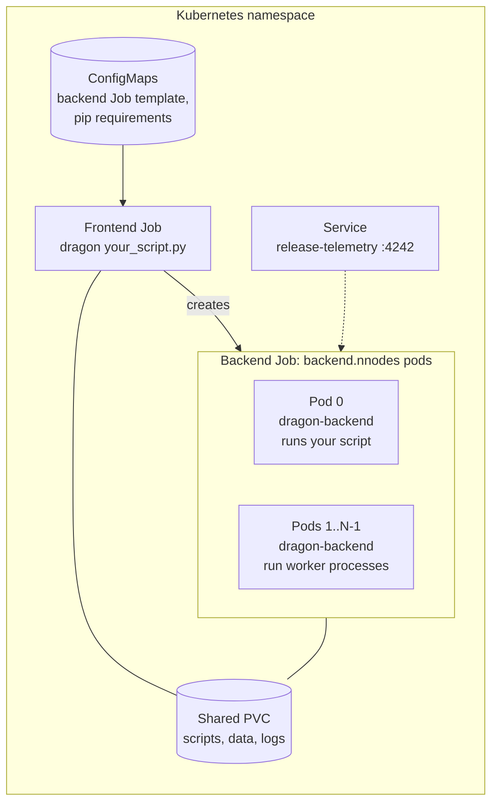

# DragonHPC chart

> [!IMPORTANT]
> This is an **example** chart. It shows one way to run a [Dragon](https://dragonhpc.org) program on Kubernetes. You
> need to supply your own container image, shared storage, and program, and you'll probably need to adjust the
> resources and scheduling settings in `values.yaml` for your cluster. Treat the chart as a starting point, not as a
> supported product.

This chart runs one Python program under the Dragon runtime across `backend.nnodes` pods. Installing the release starts
the runtime and runs your program. When the program exits, the runtime shuts down and the Jobs complete, much like a
batch job on an HPC scheduler.

To work interactively in Jupyter instead, use the [dragonhpc-jupyter](../dragonhpc-jupyter) chart.

## How it works



1. `helm install` creates a frontend Job, a ConfigMap that holds a template for the backend Job, a ConfigMap with
   optional pip requirements, a telemetry Service, and a ServiceAccount with RBAC rules for each tier.
2. In the frontend pod, a `busybox` init container creates a directory for the release under the
   [working directory](#working-directory-and-logs). Then the frontend container runs `frontend.args`. By default, that
   script installs the optional pip packages, configures the transport, and runs `dragon <your program>`.
3. The Dragon launcher detects Kubernetes, reads the backend template from the ConfigMap, and creates the backend Job
   with `backend.nnodes` pods. Each backend pod runs `backend.args`, which ends with `dragon-backend`. The frontend Job
   owns the backend Job, so deleting the frontend Job also deletes the backend pods.
4. Dragon runs your program on the primary backend pod (pod 0). Processes that your program starts, such as
   `multiprocessing.Pool` workers, are spread across all backend pods. Their output is forwarded to the frontend pod's
   log.
5. When your program exits, Dragon shuts down, the Jobs complete, and Kubernetes deletes them after
   `ttlSecondsAfterFinished` seconds (300 by default).

Your program runs in a backend pod, not in the frontend. The program and its input files must be available at the same
path in frontend and backend pods, either on a shared volume or built into the image.

## Prerequisites

- A Kubernetes cluster where you can create Jobs, Services, ConfigMaps, ServiceAccounts, Roles, and RoleBindings in
  the target namespace.
- [Helm 3](https://helm.sh/docs/intro/install/) and `kubectl`.
- One schedulable node per backend pod. The chart prefers to put backend pods on separate nodes and away from the
  frontend pod, but doesn't require it.
- Permission to run **privileged** pods. Backend pods run privileged with the `IPC_LOCK`, `IPC_OWNER`, and
  `SYS_RESOURCE` capabilities, which Dragon needs for shared memory and RDMA. Namespaces that enforce the `baseline` or
  `restricted` [Pod Security Standard](https://kubernetes.io/docs/concepts/security/pod-security-standards/) reject
  these pods.
- A container image for both frontend and backend pods. The image needs:
  - Python with the `dragonhpc` package (`pip install dragonhpc`), ideally at the chart's `appVersion` (`0.12.0`)
  - the `kubernetes` Python package, which Dragon uses to talk to the Kubernetes API
  - UCX libraries in `/usr/lib/x86_64-linux-gnu/`, if you keep the default high-speed transport setup in
    `frontend.args` and `backend.args`

  [deploy/kubernetes/Dockerfile](https://github.com/DragonHPC/dragon/blob/main/deploy/kubernetes/Dockerfile) in the
  Dragon repository is a good place to start.
- A `ReadWriteMany` PersistentVolumeClaim that all pods can mount, for your program, its data, and logs. The defaults
  expect a claim named `dragon-shared`, mounted at `/shared`.
- Access to the `busybox` image, which the init container and the uninstall hook use.

## Configure

Create a values file for your cluster. Check these values first:

| Value | Default | What to change |
|---|---|---|
| `frontend.image`, `backend.image` | `<your-repository-here>:<your-tag-here>` | Point both at your Dragon image. |
| `frontend.args` | Runs `dragon --telemetry-level=3 /shared/your_script.py` | Replace `/shared/your_script.py` with the path to your program. |
| `frontend.volumes`, `frontend.volumeMounts`, `backend.volumes`, `backend.volumeMounts` | PVC `dragon-shared` mounted at `/shared` | Create a PVC named `dragon-shared`, or replace `volumes` under both `frontend` and `backend` with your own claim. |
| `backend.resources` | 4 `nvidia.com/gpu` (request and limit) | Set the GPU, CPU, and memory for each backend pod. On CPU-only clusters, set to `null`. |
| `backend.tolerations` | Tolerate `node-role.kubernetes.io/compute` and `nvidia.com/gpu.present` taints | Add tolerations for any taints on the nodes you want to use. |
| `sharedMemoryVolume.sizeLimit` | `256Gi` | Dragon allocates its memory pools in `/dev/shm`, which is memory-backed. Keep this within the memory of a node. |
| `backend.nnodes` | `1` | Set the number of backend pods. |

> [!NOTE]
> Helm merges maps from your values file into the chart defaults, but it replaces lists. To remove a default map entry,
> such as the GPU request in `backend.resources`, set it to `null`. Lists such as `volumes`, `tolerations`, and `args`
> are replaced completely by whatever you provide.

### Example: hello Dragon

This program starts a pool of workers and prints which backend pod ran each task:

```python
# hello_dragon.py
import multiprocessing as mp
import socket

import dragon  # registers the "dragon" start method


def where(i):
    return i, socket.gethostname()


if __name__ == "__main__":
    mp.set_start_method("dragon")
    with mp.Pool(8) as pool:
        for i, host in pool.map(where, range(8)):
            print(f"task {i} ran on {host}", flush=True)
```

Copy `hello_dragon.py` to the top level of the `dragon-shared` PVC, which pods mount at `/shared`. For example, use
`kubectl cp` to copy it into any running pod that mounts the PVC. Then use a values file like this one:

```yaml
frontend:
  image:
    repository: registry.example.com/dragon
    tag: "0.12.0"
  # This replaces the whole default script. Only the dragon line differs from the default.
  args:
    - |
      if [ -f /tmp/requirements.txt ]; then
          python3 -m pip install -r /tmp/requirements.txt;
      fi;
      python3 -m dragon.cli dragon-config add --ucx-runtime-lib=/usr/lib/x86_64-linux-gnu/ --ucx-include=/usr/include --ucx-build-lib=/usr/lib/x86_64-linux-gnu/;
      dragon /shared/hello_dragon.py

backend:
  nnodes: 2
  image:
    repository: registry.example.com/dragon
    tag: "0.12.0"
  # This example uses CPUs only. Remove this line to keep the default GPU request.
  resources: null
```

The output lists backend pod names as hostnames. Because Dragon spreads the pool workers across the backend pods, you
should see more than one pod name.

## Run

1. Choose a release name of **19 characters or fewer** (see [Known limitations](#known-limitations)) and a namespace:

   ```bash
   export RELEASE=hello
   export NAMESPACE=dragon
   ```

2. Install the chart. Run this from the repository root:

   ```bash
   helm install ${RELEASE} ./charts/dragonhpc -n ${NAMESPACE} -f my-values.yaml
   ```

   To change a single value from the command line, add `--set`. For example, `--set backend.nnodes=4`.

3. Watch the pods start. The frontend pod comes up first, and the backend pods appear after Dragon creates the backend
   Job:

   ```bash
   kubectl get pods -n ${NAMESPACE} -l app.kubernetes.io/instance=${RELEASE} -w
   ```

4. Follow your program's output in the frontend pod's log:

   ```bash
   kubectl logs -n ${NAMESPACE} -f --tail=-1 -c frontend \
     -l app.kubernetes.io/instance=${RELEASE},app.kubernetes.io/component=dragon-frontend
   ```

Kubernetes deletes the Jobs and their logs 300 seconds after they finish. To keep logs longer, increase
`frontend.ttlSecondsAfterFinished` and `backend.ttlSecondsAfterFinished`, or have your program write results to the
shared volume.

### Install extra Python packages

To install packages with `pip` when the pods start, list them in `python.packages`, one per line:

```yaml
python:
  packages: |
    numpy
    scipy==1.13.1
```

The chart mounts the list as `/tmp/requirements.txt` in the frontend and backend pods, and the default `args` run
`pip install -r /tmp/requirements.txt` before Dragon starts. If you override `frontend.args` or `backend.args`, keep that
step. Because every pod installs the packages each time it starts, build large dependencies into the image instead.

### Working directory and logs

The chart sets the working directory for frontend and backend pods as follows. Only the `frontend.*` values are used.

| Condition | Working directory | Directory created by the init container |
|---|---|---|
| `frontend.workingDir` is set | `<frontend.volumeMounts[0].mountPath>/<workingDir>/<batchName>` | `<working directory>/<release>` |
| `frontend.volumeMounts` has 2 or more entries | `<frontend.volumeMounts[1].mountPath>` | `<working directory>/<release>` |
| Neither | The image's working directory | None |

Backend pods use the same path, so mount the same volumes at the same paths in `backend.volumeMounts`. When you run
`dragon -l <level>` to turn on logging, Dragon writes log files to the working directory. When you uninstall, a
pre-delete hook removes this release's log files from it.

## Telemetry

The default `frontend.args` run `dragon --telemetry-level=3`, and the chart creates a `<release>-telemetry` Service on
port 4242. The Service routes to the backend pod that runs Dragon's telemetry aggregator, which serves an
OpenTSDB-compatible API. To view the metrics, add the Service to Grafana as an OpenTSDB data source. A Grafana instance
in the same cluster can use `http://<release>-telemetry.<namespace>.svc.cluster.local:4242`. You can also forward the
port to your machine:

```bash
kubectl port-forward -n ${NAMESPACE} svc/${RELEASE}-telemetry 4242:4242
```

The Service has an endpoint only while the program runs. Telemetry also requires the `dragonhpc[telemetry]` extras in
the image. To turn off telemetry, remove `--telemetry-level` from the `dragon` command.

## Uninstall

```bash
helm uninstall ${RELEASE} -n ${NAMESPACE}
```

Uninstalling removes everything the release created. Uninstall even after your program finishes, because the
ConfigMaps, Service, and RBAC objects stay until you do. To run the program again, uninstall and then install, or
install with a new release name.

## Values reference

| Key | Default | Description |
|---|---|---|
| `backend.nnodes` | `1` | Number of backend pods, which is the number of Dragon nodes. |
| `backend.nodeName` | unset | If set, schedules every backend pod on this node. |
| `frontend.image`, `backend.image` | placeholders | Container image `repository`, `tag`, and `pullPolicy`. If `tag` is empty, the chart's `appVersion` is used. |
| `frontend.imagePullSecrets`, `backend.imagePullSecrets` | `[]` | Secrets for pulling from a private registry. |
| `frontend.command`, `frontend.args` | Install packages, configure the UCX transport, then run `dragon` | Frontend entry point. Put your program here. |
| `backend.command`, `backend.args` | Install packages, configure the UCX transport, then run `dragon-backend` | Backend entry point. The last command must be `dragon-backend`. |
| `frontend.env`, `backend.env` | none | Extra environment variables, given as a list of `name`/`value` entries. |
| `python.packages` | empty | Packages to install with `pip` when pods start, one per line. |
| `pythonPaths` | `[]` | Directories joined into `PYTHONPATH` in every pod. |
| `frontend.workingDir`, `frontend.batchName` | empty | Choose the working directory. See [Working directory and logs](#working-directory-and-logs). |
| `frontend.volumes`, `backend.volumes`, `frontend.volumeMounts`, `backend.volumeMounts` | PVC `dragon-shared` at `/shared` | Volumes for your program, data, and logs. |
| `sharedMemoryVolume.name`, `sharedMemoryVolume.sizeLimit`, `sharedMemoryVolume.mountPath` | `dragonshm`, `256Gi`, `/dev/shm` | Memory-backed `emptyDir` that's mounted in every pod for Dragon's shared memory. |
| `frontend.resources`, `backend.resources` | none, 4 GPUs | Container resource requests and limits. |
| `frontend.nodeSelector`, `backend.nodeSelector`, `frontend.affinity`, `backend.affinity`, `frontend.tolerations`, `backend.tolerations` | No node selectors. The backend tolerates two taints. | Pod scheduling. If `backend.affinity` is empty, backend pods avoid the frontend's node. |
| `backend.topologySpreadConstraints` | Spread across nodes | If empty, the chart spreads backend pods across nodes on a best-effort basis. |
| `frontend.securityContext`, `backend.securityContext`, `frontend.podSecurityContext`, `backend.podSecurityContext` | Backend is privileged | Pod and container security settings. |
| `frontend.serviceAccount.*`, `backend.serviceAccount.*`, `frontend.rbac.create`, `backend.rbac.create` | Create all | ServiceAccounts and Roles. The frontend needs to create Jobs and read pods. The backend Role can also manage pods, Services, and Ingresses in the namespace. |
| `frontend.ttlSecondsAfterFinished`, `backend.ttlSecondsAfterFinished` | `300` | How long, in seconds, Kubernetes keeps a finished Job before deleting it. |
| `telemetryService.name`, `telemetryService.type`, `telemetryService.port`, `telemetryService.targetPort`, `telemetryService.protocol` | `telemetry`, `ClusterIP`, `4242`, `4242`, `TCP` | Telemetry Service. Its name is prefixed with the release name. |
| `nameOverride`, `fullnameOverride` | `""` | Override the names that the chart generates. |
| `domain.name` | empty | Passed to pods as `DOMAIN_NAME`. This example doesn't use it. |

## Known limitations

- **Release names can be at most 19 characters.** Dragon labels pods with values such as
  `<release>-dragonhpc-<timestamp>-backend_aggregator`, and Kubernetes limits label values to 63 characters. If the name
  is too long, `helm install` fails with a `must be no more than 63 characters` error. Another option is to set
  `nameOverride` to a shorter name.
- **Each release runs once.** Job names include the time of install, so this chart isn't designed for `helm upgrade`. To
  run again, uninstall and then install.
- **Security.** Backend pods are privileged, and the program you run has the permissions of the backend
  ServiceAccount. Run only code that you trust.

## Troubleshooting

| Symptom | Likely cause |
|---|---|
| Pods stay `Pending` | Node selectors, tolerations, or GPU requests don't match any node. Run `kubectl describe pod` to see the scheduler's reason. |
| Pods are rejected with a Pod Security error | The namespace doesn't allow privileged pods. |
| Only the frontend pod starts | Check the frontend log (see [Run](#run)). Common causes are a missing `kubernetes` Python package in the image or `frontend.rbac.create=false` without equivalent permissions. |
| `can't open file` or `No such file or directory` for your program | The program isn't at the same path in the backend pods. Check `backend.volumes` and `backend.volumeMounts`. |
| The frontend log shows a message about configuring the transport agent | The `dragon-config add` line in `args` is missing or points to a path without UCX. Dragon falls back to TCP. To learn more, see [Installation](https://dragonhpc.github.io/dragon/doc/_build/html/install.html). |

## See also

- [dragonhpc-jupyter chart](../dragonhpc-jupyter), for interactive notebooks on the same Dragon setup
- [Dragon documentation](https://dragonhpc.github.io/dragon/doc/_build/html/index.html)
- [Running Dragon across nodes](https://dragonhpc.github.io/dragon/doc/_build/html/uses/multinode.html)
- [Dragon source code](https://github.com/DragonHPC/dragon)
